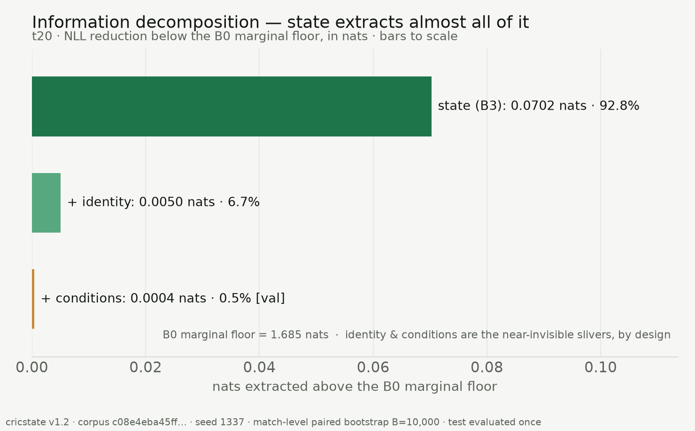
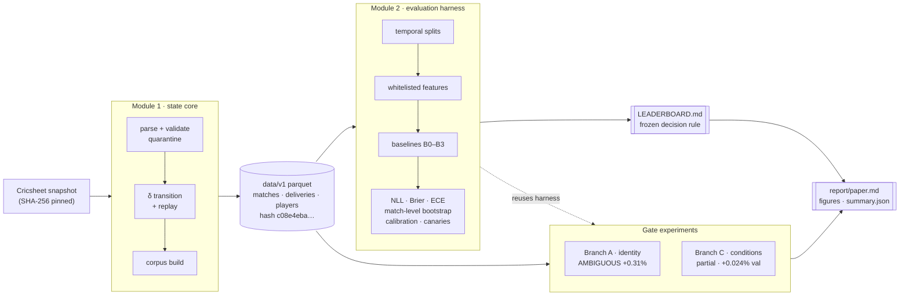

# cricstate

[](https://github.com/dudailia/cricstate/actions/workflows/ci.yml)
[](LICENSE)
[](https://creativecommons.org/licenses/by-sa/4.0/)
[](pyproject.toml)
[](https://github.com/astral-sh/uv)
[](docs/REPRODUCE.md)

**How much predictive signal is there in free ball-by-ball cricket data beyond
match state?** A reproducible research repository that answers with a
**pre-registered negative result** — a strong state model, two honest
enrichment experiments, and a single-touch evaluation protocol fixed before the
test split was ever read. Built on 16,754 matches (4.75M deliveries).

<p align="center">
  
</p>

> **Match state is saturating.** It captures ~93% of the recoverable-above-marginal
> signal. Player identity adds only **+0.31%** NLL (verdict *AMBIGUOUS*); a
> causal per-match conditions latent adds **+0.024%** on validation
> (*negligible*). The two obvious enrichments do not clear a fixed materiality bar.
> The value of this repository is the honesty of that measurement, not a model
> that wins. See the paper: [`report/paper.md`](report/paper.md).

**Choose your depth** — **60 seconds:** the
[project page](https://dudailia.github.io/cricstate/). **10 minutes:** the
paper, [typeset](https://dudailia.github.io/cricstate/paper/) or as
[markdown](report/paper.md). **Auditor mode:** [`docs/REPRODUCE.md`](docs/REPRODUCE.md)
end-to-end, then the frozen decision rule in
[`docs/SPEC_M2.md`](docs/SPEC_M2.md) §6 — committed to git before any result
existed. The [docs index](docs/README.md) has a guided reading order.

Most sports-prediction results are unfalsifiable: tuned on the data they report,
scored without uncertainty, calibrated after the fact. cricstate is the
opposite, by construction:

- **Temporal splits, baked into the data** — train ends 2024-11-02, test starts
  2025-08-30; split integrity is a red-build test, not a convention.
- **Leakage canaries** — a model fit on shuffled labels/identities must
  collapse to the baseline, and a poisoned outcome column must be structurally
  unreachable by the feature builder. The structural and synthetic canaries run
  in CI; the data-driven canaries over the pinned corpus run in the validation
  report. The whole feature surface is a frozen whitelist.
- **Match-level paired bootstrap** (B = 10,000) — ball-level resampling is
  forbidden because within-match dependence makes it fake precision.
- **A pre-committed decision rule and a single test touch** (SPEC_M2 §6): two
  gates, kept distinct. The *challenger ladder gate* — ΔNLL 95% CI excluding
  zero on *both* val and test, ≥ 0.5% relative, no calibration regression. The
  *enrichment verdict bands* — an increment (identity, conditions) justifies a
  modelling tower only at ≥ 1% relative; 0.3–1% is *ambiguous*; below that,
  killed. The measurement apparatus and the one-touch discipline were frozen
  before the test split was read; each verdict is one documented, canary-gated
  evaluation. Close results are "did not beat the bar" (see §6 for the exact,
  git-checkable timeline).

> **One instrument, two tasks.** Every model is evaluated on two prediction
> tasks: **T1 — per-ball outcome** (11-class; NLL ≈ 1.6 nats — the paper's
> decomposition question) and **T2 — win probability** (binary; NLL ≈ 0.5 —
> the state-model leaderboard below). Two NLLs an order of magnitude apart are
> the two tasks, not a discrepancy.

## The headline: match state captures almost all the recoverable signal (T1)

The capstone is a pre-registered **negative result** —
[`report/paper.md`](report/paper.md). On per-ball outcome prediction (T20), we
measure whether the two features practitioners reach for next add anything over
a strong state model (B3):

| enrichment | effect over state | in context | verdict |
|---|---|---|---|
| **player identity** | −0.00504 [−0.00561, −0.00449] test NLL · **+0.31%** · 0.007 bits/ball | CI excludes 0 but below the 1% enrichment bar | **AMBIGUOUS** |
| **match conditions** (causal latent) | +0.024% · 0.0006 bits/ball, **validation only** | order of magnitude smaller | **partial (frozen at C1)** |

State captures **~93%** of the recoverable-above-marginal signal; the two
obvious enrichments buy almost nothing. Branch C (conditions) is marked
**partial completion (C1 only, no downstream change expected)** — its one-time
test evaluation was not spent, since the validation effect already establishes
negligibility. The frozen evidence set is
[`results/summary.json`](results/summary.json); regenerate all figures and
tables with `uv run python scripts/generate_figures.py`.

## The state model — T20 win probability (T2, test split, evaluated once)

| model | test NLL [95% CI] | skill vs B0 |
|---|---|---|
| B0 — match base rate | 0.69275 [0.69195, 0.69356] | +0.000 |
| B1 — bucketed table, monotone by construction | 0.54078 [0.52615, 0.55549] | +0.219 |
| B2 — regularized logistic | 0.51189 [0.49689, 0.52679] | +0.261 |
| **B3 — gradient-boosted trees** | **0.49036 [0.47547, 0.50519]** | **+0.292** |

n = 1,489 test matches / 343,287 deliveries. All numbers post-calibration
(isotonic, fit on validation only). **B3 reaches 0.490 test NLL — a +0.29
skill score over the base rate** — and is the bar any future model must beat
under the frozen rule.

## Player identity: measured, then declined

The obvious next step for any cricket model is player modeling: batter form,
bowler matchups, a hierarchical tower of identity effects. Before building it,
we **measured** it, under a fixed-rule gate experiment — one documented,
canary-gated test touch — with frozen verdict bands
(`docs/BRANCH_A_REPORT.md`):

- Train-only empirical-Bayes player effects (striker + bowler) on top of the
  frozen B3 state model, λ tuned on val, single test touch, shuffled-identity
  canary, match-level bootstrap.
- **Result: player identity is worth +0.31% NLL — 0.007 bits per ball.**
  Real (ΔNLL −0.00504 [−0.00561, −0.00449], CI excludes zero) but economically
  negligible, and that's *with* honest dilution: 5% of balls have an unknown
  incoming batter, 14–19% of test deliveries involve players unseen in train.
- The unshrunk version (M_flat) is **0.153 nats worse than no identity at
  all** — raw per-player tables destroy a good state model.
- Frozen verdict: **AMBIGUOUS, at the band floor.** Per the pre-committed
  rule: the cheap increment (M_shrunk) ships on the leaderboard; **Branches
  B/C — the hierarchical modeling tower — were declined on the evidence.**

Most projects build the tower because it's interesting. The measurement said
no. That refusal — cheap, pre-committed, and documented — is what this
repository is for.

### Where naive models die: the endgame

Calibration by game phase (T20 win probability, test split, predicted vs
observed win rate for the team batting first):

| bucket | n | B0 p̄ / observed | B3 p̄ / observed |
|---|---|---|---|
| chase, overs 17–20 | 19,190 | 0.508 / **0.659** | 0.674 / 0.659 |
| last 30 balls | 72,781 | 0.508 / 0.564 | 0.571 / 0.564 |

The constant-rate model predicts 0.508 when the true rate is 0.659 — a
15-point miss exactly where matches are decided. The calibrated ladder closes
it to ~1 point. Every leaderboard ships these bucket tables; the failure mode
is measured, not assumed away.

### The honest negative result

On the ODI cell, **B3 did NOT beat B2**: ΔNLL test −0.006 with 95% CI
[−0.019, **+0.008**] — the interval includes zero at n = 136 test matches, so
the frozen rule says *did not beat the bar*, full stop. A thin cell producing
wide intervals and a refused close call is the methodology working, not a
caveat to bury: the same rule that certifies the T20 result rejects this one.

## Reproducibility

Everything is deterministic and fingerprinted:

```
corpus            16,754 matches / 4,748,382 deliveries (Cricsheet snapshot 2026-07-02, pinned by SHA256)
corpus hash       c08e4eba45ff7a71a51c4490cfe159a2ca34a7e5382bbc902041d147a11a6781
seed              1337 end-to-end (bootstrap seed 90210)
test split        evaluated once — this release
```

Two consecutive `uv run evalkit run-all` invocations produce **byte-identical**
`docs/LEADERBOARD.md`. Golden schema files and pinned corpus/label hashes are
red-build tests: the data contract cannot drift silently. Parsing is a
deterministic automaton with quarantine-not-crash semantics — 100% of the
22,211 snapshot files either parse clean (99.1% of in-scope T20/ODI) or land
in a quarantine log with a closed-enum reason code.

```
uv sync                          # Python 3.12, locked deps (macOS: see quirk note at the end)
uv run pytest -m "not corpus"    # unit + property tests (CI set)
uv run python -m cricstate.download   # fetch + hash the Cricsheet snapshot
uv run python -m cricstate.build      # rebuild the corpus (~7 min, hash-checked)
uv run evalkit run-all           # regenerate the leaderboard (32s cached / ~18 min cold)
```

## Plugging in a challenger (Module 3+)

Implement the `Predictor` protocol (`evalkit.models.base`), fit on train, tune
on val only, and register per (task, format) cell:

```python
class MyModel:
    name = "M3_mymodel"
    version = "1.0"
    def fit(self, train: pl.DataFrame, val: pl.DataFrame) -> None: ...
    def predict_proba(self, df: pl.DataFrame) -> np.ndarray:  # [n,K] T1 / [n] T2
        ...
```

Models see only the whitelisted within-match state features — no player
identities, no venue identities, no odds. The bar to beat (T20 win
probability): **0.490 test NLL**, under the frozen §6 rule above. The rule may
not be renegotiated after results exist.

## Data attribution & license

Ball-by-ball data comes from [Cricsheet](https://cricsheet.org), maintained by
Stephen Rushe, licensed under
[CC BY-SA 4.0](https://creativecommons.org/licenses/by-sa/4.0/). Derived
tables built from that data inherit the same terms: attribute Cricsheet and
share adaptations alike. The pinned snapshot is recorded in `data/MANIFEST`.

## Architecture

Two deterministic modules and two gate experiments feed one paper. Every arrow
is reproducible; the corpus and label hashes are red-build tests.



Full walkthrough: [`docs/ARCHITECTURE.md`](docs/ARCHITECTURE.md).

## Repository map

```
src/cricstate/      Module 1 — deterministic state core: parser, validator,
                    quarantine, transition function δ, replay, corpus build
src/evalkit/        Module 2 — the measuring instrument: splits, features,
                    metrics, calibration, bootstrap, baselines B0–B3, canaries
src/visualization/  publication figure + table builders (read the frozen
                    evidence set only; run no models)
experiments/        Branch A (player identity) + Branch C (conditions latent,
                    partial — frozen at C1)
report/             paper.md (the negative result) + figures/ + tables/
results/            summary.json — the frozen, canonical evidence set
scripts/            generate_figures.py, evidence generators, corpus/eval drivers
tests/golden/       11 real pathological matches (super-over tie, D/L, penalty
                    runs, retired hurt, miscounted over, …) — exact round-trips
docs/               SPEC_M1, SPEC_M2 (+ gate-documented amendments),
                    LEADERBOARD.md, BRANCH_A_REPORT.md, STATS.md, evidence packs
```

## Known macOS quirk

uv sets the macOS `UF_HIDDEN` flag on `.venv` contents, and CPython 3.12 skips
hidden `.pth` files — which silently breaks the editable install
(`ModuleNotFoundError: cricstate`). If that happens after a fresh `uv sync`:

```
chflags -R nohidden .venv
```
