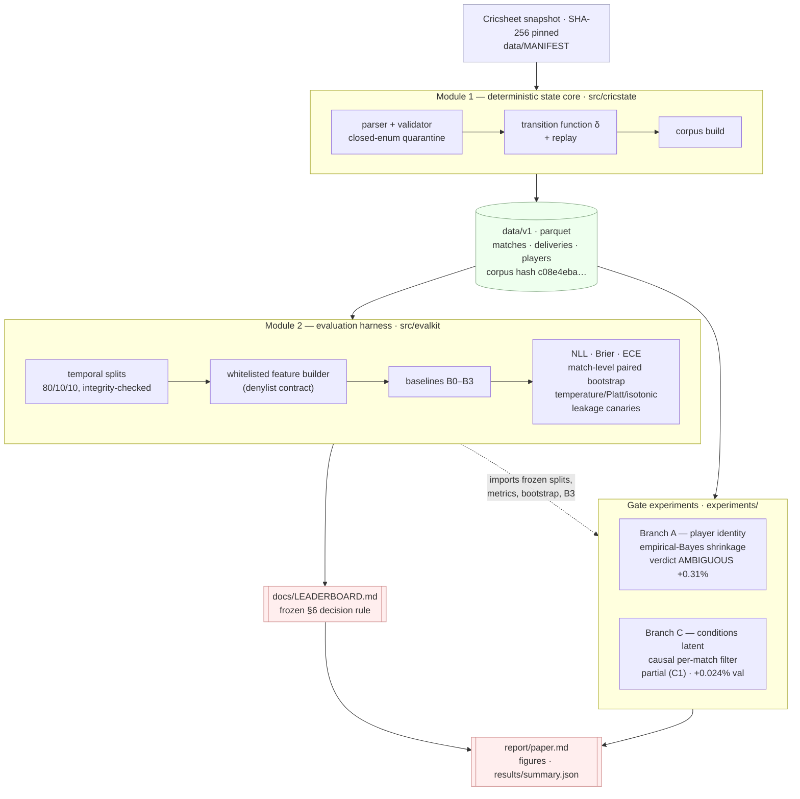

# Architecture

cricstate is two deterministic modules plus two gate experiments, arranged so
that every number in the paper is reproducible from a single pinned data
snapshot. The design rule throughout: **the evaluation harness is frozen and
reused, never reimplemented** — so the identity and conditions experiments
produce numbers directly comparable to the baseline leaderboard.

## The parts that span multiple files

### Module 1 — state core (`src/cricstate`)

A deterministic automaton with **quarantine-not-crash** semantics. Every
snapshot file either parses cleanly or lands in a quarantine log with a
closed-enum reason code; there is no silent failure. The transition function δ
folds ball-by-ball deliveries into `MatchState` sequences; `replay` reconstructs
any match, and the corpus build emits three columnar Parquet tables plus a
determinism hash. Full spec: [`docs/SPEC_M1.md`](SPEC_M1.md).

### Module 2 — evaluation harness (`src/evalkit`)

The measuring instrument, frozen at corpus tag `v1.2`:

- `splits.py` — the M1-baked temporal split, with integrity tests (no match in
  two splits; strictly ordered date boundaries).
- `features.py` — a whitelisted feature builder; a denylist contract test greps
  the emitted frame so identity/outcome columns can never leak in.
- `metrics.py`, `bootstrap.py`, `calibrate.py` — NLL/Brier/ECE, the
  **match-level paired bootstrap** (resample matches, not balls), and
  temperature/Platt/isotonic calibration fit on validation only.
- `models/` — baselines B0 (marginal), B1 (bucketed table, monotone by
  construction), B2 (regularized logistic), B3 (gradient-boosted state model).
- `canaries.py` — shuffled-target, poisoned-column, and ladder-inversion
  leakage tests, all run in CI.
- The whole evaluation regenerates with `uv run evalkit run-all`; two runs
  produce byte-identical `LEADERBOARD.md`. Full spec:
  [`docs/SPEC_M2.md`](SPEC_M2.md) (with gate-documented amendments).

### Gate experiments (`experiments/`)

Each experiment **imports** the frozen harness rather than reimplementing it,
touches the test split at most once, and ends in a pre-registered verdict:

- **Branch A — player identity** (`experiments/branch_a`): empirical-Bayes
  shrunk striker/bowler effects added to B3's logits. Verdict **AMBIGUOUS**
  (+0.31% NLL). Full report: [`docs/BRANCH_A_REPORT.md`](BRANCH_A_REPORT.md).
- **Branch C — conditions latent** (`experiments/branch_c`): a strictly causal
  per-match Bayesian filter (the estimate for ball *t* uses only prior balls in
  the same match), added as a gain-free logit tilt. **Partial completion (C1,
  validation only)** — negligible (+0.024%), frozen before its test touch.

### Paper & presentation

`results/summary.json` is the canonical frozen evidence set;
`src/visualization/` renders the figures and tables from it (running no models);
`report/paper.md` is the negative-result write-up. Regenerate the presentation
layer with `uv run python scripts/generate_figures.py`.
