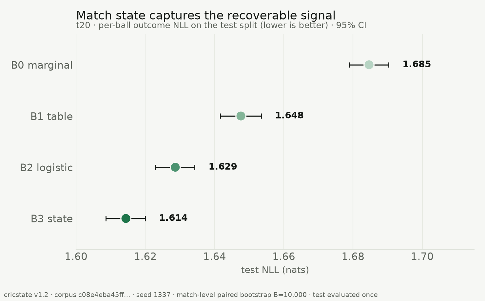
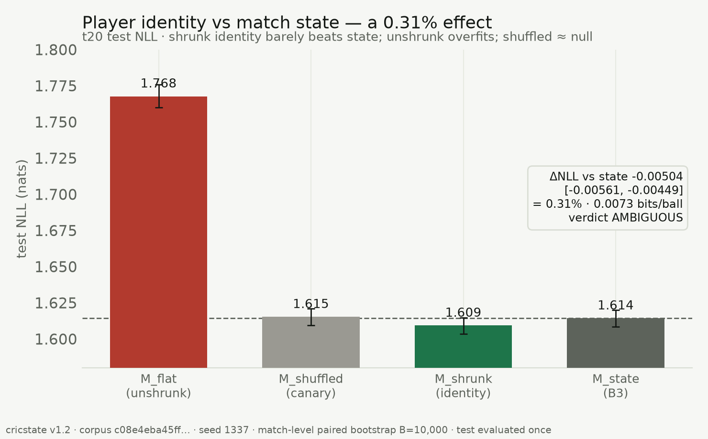
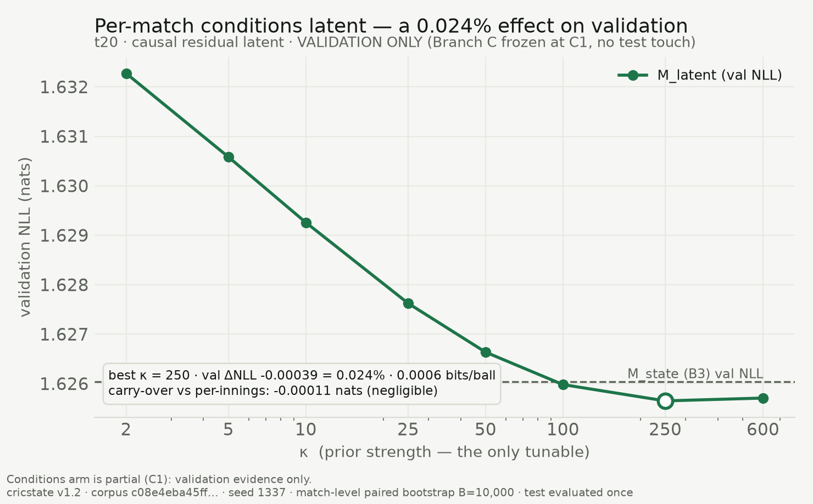
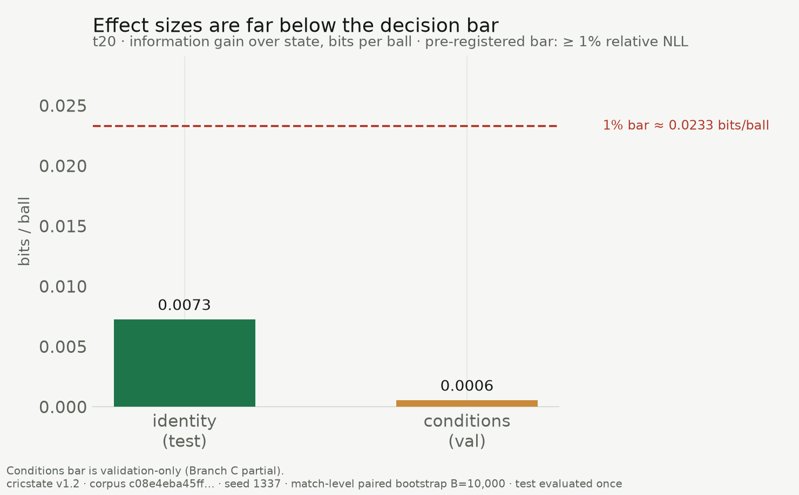
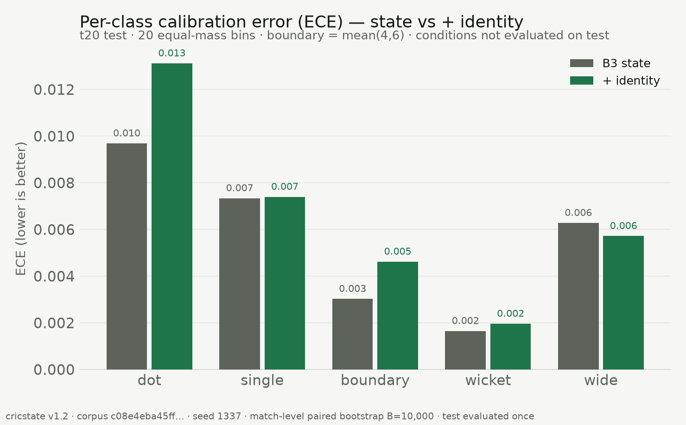

# How much predictive signal is there in free ball-by-ball cricket data beyond match state?

**A pre-registered negative result.**

*cricstate project · corpus v1.2 · all evaluation seeded (1337) and hash-pinned.*

---

## Abstract

We ask a single, falsifiable question: once a strong model conditions on
within-match **state** (score, wickets, balls, run-rate, phase), how much
*additional* predictive signal remains in the two features practitioners reach
for next — **player identity** and **match-level latent conditions** — using
only freely available ball-by-ball data? We evaluate per-ball outcome
prediction over a frozen 11-class alphabet on 16,754 men's and women's T20/ODI
matches (4.75M deliveries), with an 80/10/10 temporal split, negative
log-likelihood (NLL) as the primary metric, and 95% confidence intervals from a
**match-level paired bootstrap** (10,000 resamples). Against a gradient-boosted
state model (B3, test NLL 1.614 nats), a strongly shrunk player-identity model
improves test NLL by **0.31% (0.007 bits/ball)** — statistically distinguishable
from zero but below our pre-registered 1% materiality bar (verdict:
**AMBIGUOUS**). A causally-filtered per-match "conditions" latent improves
*validation* NLL by **0.024% (0.0006 bits/ball)**, an order of magnitude
smaller; on that evidence the arm was frozen before its one-time test
evaluation. Leakage canaries (shuffled identity, shuffled targets, poisoned
features, temporal-split integrity) all pass. We conclude that within-match
**state is saturating**: it captures ~93% of the recoverable-above-marginal
signal, and the two obvious enrichments buy almost nothing. We publish this as a
negative result, with the decision rule fixed before the test split was touched.

## 1. Introduction

Sports-modelling results are easy to report and hard to trust: models tuned on
the data they are scored on, point estimates without uncertainty, calibration
asserted after the fact. This paper is built the other way around. We fix one
hypothesis, one primary metric, one uncertainty procedure, and a decision rule
**before** looking at the test split, then report whatever the rule returns —
including "not worth it."

The substantive question is whether free ball-by-ball data contains exploitable
structure beyond match state. Two candidate sources dominate practitioner
intuition: **who** is involved (batter/bowler skill) and **where/under what
conditions** the match is played (pitch, weather, a "high-scoring day"). We
measure each as an increment over a strong state baseline, and we make the
measurement adversarial to ourselves with explicit leakage canaries.

## 2. Data

Ball-by-ball data is from [Cricsheet](https://cricsheet.org) (CC BY-SA 4.0),
pinned by SHA-256 as corpus **v1.2**. A deterministic state machine parses each
match into per-delivery rows; 100% of the 22,211 snapshot files either parse
cleanly (99.1% of in-scope T20/ODI) or land in a quarantine log with a
closed-enum reason code. The prediction target is the next delivery's outcome
over a frozen **K = 11** alphabet (dot, 1, 2, 3, 4, 6, other-runs, bye/leg-bye,
no-ball, wide, wicket). This paper studies the **T20** cell.

Splits are 80/10/10 **temporal** by match start date (train ends 2024-11-02;
test is 2025-08-30 onward), baked into the corpus so they cannot drift. Split
integrity — no match in two splits, strictly ordered date boundaries — is a
build-failing test.

## 3. Methods

**Baseline ladder and the state model (B3).** We report a ladder from a marginal
baseline (B0) through a bucketed table (B1) and regularized logistic model (B2)
to a **gradient-boosted state model (B3)** — `HistGradientBoostingClassifier`
on 27 whitelisted within-match state features, no identity, no latent
variables. B3 is the strong baseline every enrichment must beat (Table 1,
Figure 1).

**Identity model.** Per-player log-odds offsets for the on-strike batter and
the bowler over the 11 classes, estimated by **empirical-Bayes (Dirichlet)
shrinkage** toward the population marginal, and added to B3's logits. The prior
strength (λ) is the only tunable, chosen on validation; unseen players receive
the population mean (a zero offset). We also fit an **unshrunk** variant
(M_flat) to quantify the cost of not regularizing, and a **shuffled-identity**
model as a leakage canary.

**Conditions model (causal latent).** A scalar per-match "conditions" latent
θ, estimated by a conjugate Gaussian filter that is **strictly causal**: the
estimate for ball *t* uses only the outcomes of balls *before* t in the same
match. The signal is the **B3 residual** — observed scoring valence minus B3's
expected valence — so the latent can only explain scoring that state does *not*
already capture. θ enters as a gain-free exponential tilt of B3's distribution;
the prior strength κ is the only tunable, chosen on validation. A structural
unit test proves causality: permuting balls at or after *t* leaves the
prediction for *t* unchanged.

**Evaluation.** Primary metric is test **NLL** (nats). Uncertainty is a
**match-level paired bootstrap** (resample *matches*, not balls — within-match
dependence makes ball-level resampling fake precision), 10,000 resamples, fixed
seed, 95% percentile CIs on metrics and on paired deltas. We also report
multiclass Brier and per-class expected calibration error (ECE, 20 equal-mass
bins). Calibration maps (temperature) are fit on validation only.

**Pre-registered decision rule.** An enrichment **JUSTIFIES** further work iff
its paired ΔNLL 95% CI excludes 0 **and** relative improvement ≥ 1.0%;
**AMBIGUOUS** if the CI excludes 0 but improvement is in [0.3%, 1.0%); **KILL**
otherwise. The rule was fixed before the test split was evaluated and is not
renegotiated afterwards.

**Leakage canaries (all must pass).** Shuffled-identity (identities randomly
reassigned → must collapse to the state baseline within 0.01 nats),
shuffled-target (retrain on permuted labels → must sit at the marginal),
poisoned-column (an injected outcome feature must be structurally unreachable),
and temporal-split integrity.

## 4. Results

**State captures the signal (Figure 1, Table 1).** The ladder is strictly
ordered on test: B0 1.685 → B1 1.648 → B2 1.629 → **B3 1.614** nats. State
extracts **0.070 nats** below the marginal floor.

**Player identity: real but immaterial (Figure 2, Table 2).** The shrunk
identity model reaches test NLL **1.60934 [1.60360, 1.61489]**, a paired
improvement over state of **−0.00504 [−0.00561, −0.00449]** nats — the CI
excludes zero, so the effect is real, but it is only **0.31%** relative
(**0.0073 bits/ball**): **AMBIGUOUS**. The unshrunk model is **0.153 nats
worse** than state (Figure 2) — raw per-player tables destroy a good state
model — and the shuffled-identity canary sits at the baseline (+0.00095 nats,
PASS). The gain is diluted by data limits: 5.25% of test balls have an unknown
incoming batter (the observation gap) and 14–19% involve players unseen in
training. Notably, identity **slightly worsens** per-class calibration for dot
(0.010→0.013) and boundary (0.003→0.005) balls (Figure 6): the small NLL gain
is not a free calibration win.

**Match conditions: negligible on validation (Figure 3, Table 3).** The causal
latent's validation NLL curve is unimodal with an interior optimum at κ = 250,
where it improves validation NLL by **−0.00039 nats = 0.024% (0.0006
bits/ball)** — an order of magnitude below the identity effect. A per-innings
variant (no cross-innings carry-over) differs from the full-match latent by
only ~0.0001 nats, so the pitch-persistence/team-quality confound is not
materially active. **On this evidence the conditions arm was frozen at its
validation stage (C1); its one-time test evaluation was not run.** We therefore
make no test-set claim for conditions.

**Information decomposition (Figure 4).** Of the signal recoverable above the
marginal floor, state accounts for **92.8%**, identity for 6.7% (test), and
conditions for 0.5% (validation). Both enrichments are near-invisible slivers.

**Effect sizes vs the bar (Figure 5).** Both increments sit far below the 1%
materiality threshold (≈ 0.023 bits/ball): identity at 0.0073, conditions at
0.0006 bits/ball.

**Leakage canaries (Table 4).** Shuffled-identity, shuffled-target,
poisoned-column, and temporal-split integrity all **PASS**. The match-shuffle
canary for the conditions arm was not run (arm frozen at C1).

## 5. Discussion

**State saturation.** The consistent finding across both arms is that a
gradient-boosted model of within-match state already captures nearly all the
per-ball predictive structure that free ball-by-ball data exposes. Identity
adds a real but sub-materiality 0.31%; a causal conditions latent adds an
order of magnitude less. The practitioner's two obvious next features do not,
on this data, clear a pre-registered bar.

**Scope of the conditions null.** By construction the conditions latent is a
**scoring-valence** signal (runs-weighted). A null therefore rules out a
per-match *scoring-rate* conditions factor beyond state — not conditions in
general. A pitch that is wicket-prone without being low-scoring is invisible to
a runs-weighted latent; that hypothesis remains open.

**Why we froze Branch C.** The validation effect (0.024%) is an order of
magnitude below an already-AMBIGUOUS identity effect and far below the KILL
threshold. Spending the one-time test evaluation was not warranted; freezing at
validation is the honest, discipline-preserving choice and is marked as
**partial completion**.

**Honesty over performance.** Every number here is directly comparable to a
frozen leaderboard because the same harness (splits, metrics, bootstrap, B3)
produced all of them. The unshrunk identity result and the identity-calibration
regression are reported precisely because they cut against a "player modelling
helps" narrative.

## 6. Limitations

- **One format, one task.** T20, per-ball outcome only; ODI and win-probability
  are out of scope here.
- **Conditions arm is validation-only** (partial): no test-set claim.
- **Scoring-valence latent** cannot see non-scoring conditions structure.
- **Free data only:** no player biometrics, no ball-tracking, no venue/weather
  covariates — by design; the question is what *free ball-by-ball* data yields.
- **Data dilution** (observation gap, unseen players) attenuates the identity
  estimate; the reported effect is a lower bound in that sense.

## 7. Conclusion

Within-match state is a saturating predictor of the next ball in free
ball-by-ball cricket data. Player identity contributes a real but immaterial
0.31% (AMBIGUOUS under a pre-registered rule); a causal per-match scoring
conditions latent contributes a negligible 0.024% on validation and was frozen
before its test evaluation. The scientific content of this repository is not a
model that wins — it is a measurement, made adversarial to itself and
pre-committed, that says the obvious enrichments are not worth building.

## 8. Reproducibility

- Corpus **v1.2**, SHA-256 `c08e4eba…a11a6781`; labels `e11bf9c8…20324f`.
- Seed **1337** end-to-end; bootstrap seed 90210, 10,000 match-level resamples.
- Test split evaluated once (identity); conditions test not evaluated (frozen).
- Evidence set: [`results/summary.json`](../results/summary.json). Figures:
  [`report/figures/`](figures/). Tables: [`report/tables/`](tables/).
- Regenerate figures/tables from the frozen evidence:
  `uv run python scripts/generate_figures.py`.
- Full leaderboard and branch reports: `docs/LEADERBOARD.md`,
  `docs/BRANCH_A_REPORT.md`, `artifacts/branch_c/c1_kappa_curve.json`.

## Figures

**Figure 1.** The B0→B3 state ladder (t20 test NLL). State extracts the signal.

**Figure 2.** Player identity vs state. Shrunk identity barely beats state
(0.31%, AMBIGUOUS); the unshrunk model overfits; the shuffled canary sits at
the baseline.

**Figure 3.** The conditions latent's validation κ curve (unimodal, interior
optimum). Validation only — Branch C is frozen at C1.

**Figure 4.** Information decomposition: state 92.8%, identity 6.7% (test),
conditions 0.5% (validation) of the signal above the marginal floor.

**Figure 5.** Effect sizes in bits/ball against the 1%-improvement bar. Both
enrichments fall far short.

**Figure 6.** Per-class calibration (ECE), state vs +identity on test. Identity
slightly worsens dot and boundary calibration.

## References

- S. Rushe, *Cricsheet* — ball-by-ball cricket data, CC BY-SA 4.0.
  https://cricsheet.org
- Full method and frozen conventions: `docs/SPEC_M1.md`, `docs/SPEC_M2.md`
  (with gate-documented amendments) in this repository.
